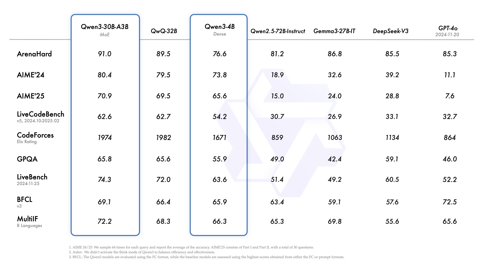
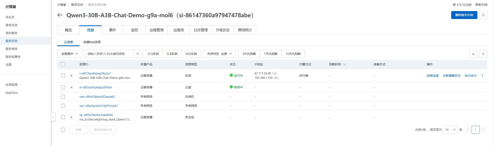
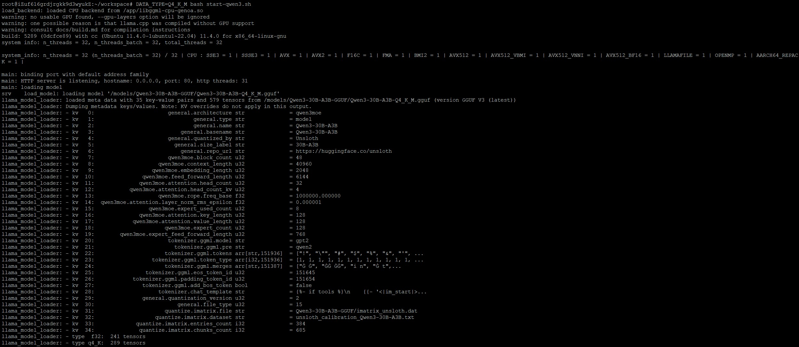
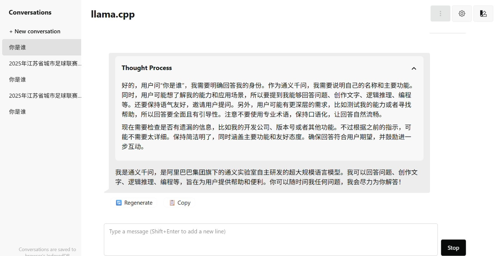

# Qwen3-30B-A3B chat 单机CPU版部署文档

## Qwen3-30B-A3B简介
Qwen3-30B-A3B是Qwen 系列大型语言模型的最新成员之一。小型 MoE 模型 Qwen3-30B-A3B 的激活参数数量是 QwQ-32B 的 10%，准确性更胜一筹,推理速度更快。
详细的Qwen3模型介绍可以参考[Qwen3](https://qwenlm.github.io/zh/blog/qwen3/)


Qwen3 模型支持两种思考模式： 
* 思考模式：在这种模式下，模型会逐步推理，经过深思熟虑后给出最终答案。这种方法非常适合需要深入思考的复杂问题。 
* 非思考模式：在此模式中，模型提供快速、近乎即时的响应，适用于那些对速度要求高于深度的简单问题。 

本服务在AMD Turin ecs.g9a.8xlarge 实力上完成Qwen3-30B-A3B模型的简单对话部署。


## llama.cpp 简介
llama.cpp 是一个高性能的C++库，由 Georgi Gerganov 开发，旨在以最少的设置和最先进的性能在各种硬件上实现大型语言模型推理。其主要特点包括：
* 纯C/C++实现：没有任何依赖，适用于各种操作系统，包括 Linux 、 macOS 、 Windows 、 iOS 、 Android 和 WASM 。
* 多平台支持：支持 x86架构 的 AVX 、 AVX2 、 AVX512 和 AMX指令集 ，以及 ARM NEON 、 Accelerate 和 Metal框架 。此外，还支持 NVIDIA GPU 的 CUDA内核 ，并通过 HIP支持AMD GPU ，通过 MUSA支持摩尔线程MTT GPU 。
* 模型量化：支持1.5位、2位、3位、4位、5位、6位和8位整数量化，以实现更快的推理和更低的内存使用。
* 高性能推理：通过底层优化（如多线程和SIMD指令集）和模型量化技术，llama.cpp能够在资源受限的设备上实现大模型的轻量化推理。
* 功能丰富：支持模型推理、多轮对话、流式输出、多种采样策略（如Top-k、Top-p、Temperature、Mirostat等）、模型格式转换工具、分词工具等。
* llama.cpp特别适合在资源有限的设备上运行，如树莓派、手机等，并且所有内容可离线运行，无需联网，适合搭建含有非公开信息的个人和企业知识库。
* 此外，llama.cpp还提供了API服务，支持HTTP和WebSocket模式接口，方便嵌入到各种应用中。


## 计费说明
Qwen3-30B-A3B chat 在阿里云上的费用主要涉及：
* 所选CPU云服务器的规格
* 磁盘容量
* 公网带宽
计费方式：按量付费（小时）或包年包月
预估费用在创建实例时可实时看到。


## RAM账号所需权限

| 权限策略名称                          | 备注                     |
|---------------------------------|------------------------|
| AliyunECSFullAccess             | 管理云服务器服务（ECS）的权限       |
| AliyunVPCFullAccess             | 管理专有网络（VPC）的权限         |
| AliyunROSFullAccess             | 管理资源编排服务（ROS）的权限       |
| AliyunComputeNestUserFullAccess | 管理计算巢服务（ComputeNest）的用户侧权限 |


## 部署流程

1. 单击[部署链接](https://computenest.console.aliyun.com/service/instance/create/cn-hangzhou?type=user&ServiceName=Qwen3-30B-A3B-Chat-CPU版本-AMD&ServiceVersion=draft)。根据界面提示选择模型并填写参数，可以看到对应询价明细，确认参数后点击**下一步：确认订单**。

   
	
2. 创建VPC,填写用户名/密码，选择系统盘，确认订单完成后同意服务协议并点击**立即创建**。
   
   
 
3. 等待部署完成后就可以开始使用服务，进入服务实例详情页，在资源栏中远程连接ECS
   

4. 在终端中进入workspace目录，可以使用三种不同的模型精度，开始服务端模式。Q4_K_M生成速度较快。第一次启动，需要等待模型加载到内存，之后启动速度会加快。

选择一个：
* DATA_TYPE=Q4_K_M bash start-qwen3.sh
* DATA_TYPE=BF16 bash start-qwen3.sh
* DATA_TYPE=Q8_0 bash start-qwen3.sh

看到如下运行结果，显示服务启动成功。
   
   
   
## 使用说明 公网WebUI地址
等待命令执行完成后通过概览页提供的公网地址访问服务， 打开 http://外网IP,默认端口80，然后开始对话。
    

## [演示视频](demo.gif)

## 性能测试

Llama.cpp自带了一个性能测试工具llama-batched-bench，可以通过以下方式运行性能测试:

```shell
CPU_CORES=0-31
numactl -C ${CPU_CORES} -m 0 ./llama-batched-bench -m =/models/Qwen3-30B-A3B-GGUF/Qwen3-30B-A3B-Q4_K_M.gguf --numa numactl -ngl 0 -c 16384 -fa -npp 512 -ntg 4096 -npl 1,2,4,8,16 --no-mmap --threads 32 --cpu-strict 1 --threads-batch 32 --cpu-strict-batch 1 --cache-type-k q4_0 -b 2048 -ub 512
```

## 启动脚本

```shell
SW_STACK=${1:-"default"}
MODEL=${2:-"Qwen3-30B-A3B-GGUF"}
MODEL_PATH=${MODEL_PATH:-"/root/workspace/models/unsloth/"}
DATA_TYPE=${DATA_TYPE:-"BF16"}

MODEL_PATH="/root/workspace/models/unsloth"

MODEL_QWEN3_30B_A3B_BF16=/models/Qwen3-30B-A3B-GGUF/BF16/Qwen3-30B-A3B-BF16-00001-of-00002.gguf
MODEL_QWEN3_30B_A3B_Q4_K_M=/models/Qwen3-30B-A3B-GGUF/Qwen3-30B-A3B-Q4_K_M.gguf
MODEL_QWEN3_30B_A3B_Q8_0=/models/Qwen3-30B-A3B-GGUF/Qwen3-30B-A3B-Q8_0.gguf

if [[ $DATA_TYPE == "BF16" ]]; then
  MODEL_GGUF_FILE=$MODEL_QWEN3_30B_A3B_BF16
elif [[ $DATA_TYPE == "Q4_K_M" ]]; then
  MODEL_GGUF_FILE=$MODEL_QWEN3_30B_A3B_Q4_K_M
elif [[ $DATA_TYPE == "Q4_K_M" ]]; then
  MODEL_GGUF_FILE=$MODEL_QWEN3_30B_A3B_Q8_0
fi

cores=$(lscpu --online --parse=Core | grep --invert-match '^#' | sort --unique | wc --lines)
sockets=$(lscpu --online --parse=Socket | grep --invert-match '^#' | sort --unique | wc --lines)
cores_per_socket=$(( ${cores} / ${sockets}))
numas=$(lscpu | grep "NUMA node(s):" | awk -F ":" '{ printf "%d",$2}')
numas_cores=$(lscpu | grep "NUMA node0 CPU(s)" | awk -F ":" '{ printf "%s",$2}')
numas_per_socket=$(($numas / $sockets))
cores_per_numa=$(( $cores_per_socket /$numas_per_socket ))

CPU_CORES=$numas_cores
PORT=80
THREADS=$(( $cores * 2 ))
docker run -it --rm --privileged -v $MODEL_PATH:/models -p $PORT:$PORT llama-cpp-alicloud-base:latest numactl -C ${CPU_CORES} -m 0 ./llama-server -m $MODEL_GGUF_FILE --port $PORT --host 0.0.0.0 --numa numactl -ngl 0 -c 16384 -fa -np 1 --no-mmap --threads $THREADS --cpu-strict 1 --threads-batch $THREADS --cpu-strict-batch 1 --cache-type-k q4_0 -b 2048 -ub 512

```
